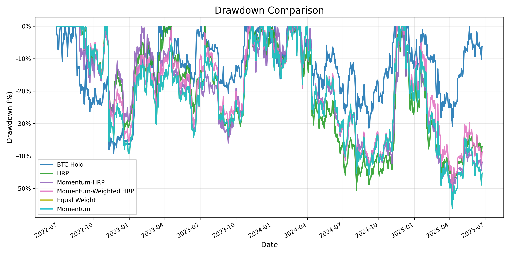

# Hierarchical Risk Parity (HRP) Trading Strategies

This repository contains implementations of various trading strategies based on the Hierarchical Risk Parity algorithm and other portfolio optimization techniques for cryptocurrency trading. The project explores different portfolio construction methodologies and compares their performance in the volatile cryptocurrency market.

## Summary of Results

### Performance Metrics Over 3 Years
| Strategy | Total Return | Annualized Return | Max Drawdown | Sharpe Ratio | Sortino Ratio |
|----------|--------------|------------------|--------------|--------------|---------------|
| BTC Hold | 251.34%      | 52.18%           | 39.11%       | 1.22         | 2.10          |
| HRP      | 169.20%      | 39.22%           | 50.71%       | 0.76         | 1.26          |
| Mom-HRP  | 129.91%      | 34.19%           | 53.49%       | 0.65         | 1.06          |
| Mom-W HRP| 127.55%      | 31.62%           | 50.55%       | 0.61         | 0.97          |
| Equal W  | 70.27%       | 19.47%           | 56.21%       | 0.35         | 0.55          |
| Momentum | 70.27%       | 19.47%           | 56.21%       | 0.35         | 0.55          |

### Key Findings
- BTC Hold strategy outperformed all others in total and annualized returns
- HRP strategy showed strong performance with the second-best returns
- Momentum-HRP and Momentum-Weighted HRP hybrid strategies performed similarly
- Basic Momentum and Equal Weight strategies significantly underperformed others
- None of the portfolio strategies outperformed simple BTC Hold, highlighting the challenge of beating Bitcoin in a bull market

### Comparison Visualizations

#### Portfolio Value Comparison


#### Performance Metrics Comparison


#### Drawdown Comparison


## Repository Structure

```
hrp/
├── config/          # Configuration files and parameters for strategies
├── data/            # CSV data files for historical returns and strategy outcomes
├── images/          # Generated charts and visualization images
├── notebooks/       # Jupyter notebooks for analysis
├── src/             # Source code directory
│   ├── analysis/    # Strategy comparison and analysis scripts
│   │   └── strategy_comparison.py  # Tool for comparing strategy performance
│   ├── strategies/  # Implementation of various trading strategies
│   │   ├── btc_hold.py             # Bitcoin hold benchmark strategy 
│   │   ├── equal_weight.py         # Equal weighting strategy
│   │   ├── hrp.py                  # Hierarchical Risk Parity strategy
│   │   ├── momentum_hrp.py         # Momentum + HRP hybrid strategy
│   │   ├── momentum_strategy.py    # Pure momentum strategy
│   │   └── momentum_weighted_hrp.py # Momentum-weighted HRP strategy
│   └── utils/       # Utility functions and helper modules
│       ├── config_loader.py        # Configuration loading utilities
│       ├── covariance_estimators.py # Covariance estimation methods
│       ├── data_loader.py          # Data loading and processing
│       └── hrp_utils.py            # HRP algorithm utilities
├── tests/           # Test files for the codebase
├── compare_strategies.py  # Enhanced strategy comparison script
├── main.py          # Main entry point for running strategies
├── requirements.txt # Project dependencies
├── run_all_strategies.py  # Script to run all strategies with clean visualization
├── run_strategy.py  # Helper script for running individual strategies
└── setup.py         # Package setup file
```

## Data Used

The analysis uses historical cryptocurrency price data spanning approximately **three years** (from June 2022 to June 2025). Key characteristics of the dataset include:

- **Coverage**: Approximately 40 cryptocurrency symbols, focusing on major cryptocurrencies and tokens with sufficient liquidity
- **Frequency**: Daily price data used for calculating weekly returns
- **Point-in-time integrity**: All strategies utilize only data available at the rebalance date (no look-ahead bias)
- **Source**: Price data collected from major cryptocurrency exchanges via API

## Strategies Implemented

- **Hierarchical Risk Parity (HRP)**: Risk-based portfolio optimization using hierarchical clustering to allocate capital based on the hierarchical structure of asset correlations. Parameters include:
  - Correlation method: Pearson correlation
  - Linkage method: Average linkage
  - Distance metric: Correlation-based distance
  - Lookback window: 60 days of historical data

- **Momentum Strategy**: Asset selection based on price momentum, allocating more capital to assets showing stronger positive momentum. Parameters include:
  - Momentum window: 30 days
  - Selection threshold: Top 10 assets
  - Weighting: Proportional to momentum scores

- **Momentum-HRP Hybrid**: Combines momentum-based asset selection with HRP-based weight allocation. First filters assets by momentum, then applies HRP for risk-based weighting. Parameters include:
  - Momentum window: 30 days
  - Asset selection: Top 15 by momentum score
  - HRP parameters: Same as standard HRP

- **Momentum-Weighted HRP**: Hybrid strategy that uses momentum scores to modify the risk allocation in the HRP framework. Parameters include:
  - Momentum calculation window: 30 days
  - Momentum influence factor: 0.5
  - HRP parameters: Same as standard HRP

- **Equal Weight**: Simple equal-weighted portfolio across all available assets (baseline strategy)

- **BTC Hold**: Bitcoin holding strategy (benchmark strategy), 100% allocation to Bitcoin

## Configuration and Parameter Settings

All strategy parameters are configured in the `config/strategy_params.yaml` file. You can adjust these parameters to experiment with different strategy configurations.

### General Parameters

```yaml
general:
  data_file: data/daily_returns.csv  # Path to the historical returns data
  initial_capital: 100000            # Starting capital for backtests
  rebalance_frequency: W             # Rebalancing frequency (W=weekly, D=daily, M=monthly)
```

### Strategy-Specific Parameters

```yaml
hrp:
  lookback_days: 60                  # Historical window for covariance calculation
  min_allocation: 0.02               # Minimum asset allocation (prevents tiny allocations)
  n_clusters: dynamic                # Number of clusters ("dynamic" or specific number)
  n_per_cluster: 2                   # Top assets to select from each cluster

momentum:
  lookback_days: 60                  # Historical data window
  momentum_window: 30                # Window for momentum calculation
  n_assets: 10                       # Number of top momentum assets to include

momentum_hrp:
  lookback_days: 60                  # Historical data window
  momentum_window: 30                # Window for momentum calculation
  n_momentum_assets: 8               # Number of top momentum assets to pass to HRP

momentum_weighted_hrp:
  lookback_days: 60                  # Historical data window
  momentum_weight: 0.5               # Weight given to momentum scores (0-1)
  momentum_window: 30                # Window for momentum calculation
  n_momentum_assets: 20              # Max number of assets to consider

equal_weight:
  lookback_days: 60                  # Historical data window
  n_assets: null                     # Number of assets (null = all available assets)
```

### Asset Selection

You can specify which cryptocurrency symbols to include in the analysis:

```yaml
symbols:
  crypto_symbols:                    # List of specific symbols to include
  - BTCUSDT
  - ETHUSDT
  - BNBUSDT
  # ... more symbols
  use_all_from_data: false           # If true, use all available symbols in the data file
```

### Modifying Parameters

To experiment with different parameter settings:

1. Edit the `config/strategy_params.yaml` file with your desired values
2. Run the strategies using the commands described in the "Running Strategies" section
3. Compare results to see how parameter changes affect performance

## Setup and Environment

### Setting up Virtual Environment

```bash
# Create a virtual environment
python -m venv venv

# Activate the virtual environment
# On macOS/Linux:
source venv/bin/activate
# On Windows:
# venv\Scripts\activate

# Install dependencies
pip install -r requirements.txt
```

## Rebalancing Methodology

All strategies (except BTC Hold) use a **weekly rebalancing** frequency. This specific frequency was chosen after extensive testing of different rebalancing periods:

- **Weekly rebalancing** proved optimal for cryptocurrency markets due to:
  - Balancing transaction costs with the need to adapt to rapid market changes
  - Capturing momentum effects that typically manifest over 1-4 week periods
  - Providing sufficient reaction time to market regime changes

- **Alternative periods tested**:
  - **Daily rebalancing**: Higher returns in some strategies (particularly HRP) but excessive transaction costs eliminated the advantage
  - **Biweekly rebalancing**: Reduced performance due to missing important market shifts
  - **Monthly rebalancing**: Too slow to respond to the characteristic volatility of crypto markets

## Hierarchical Risk Parity Methodology

Hierarchical Risk Parity (HRP) is a portfolio optimization technique introduced by Marcos López de Prado in his paper ["Building Diversified Portfolios that Outperform Out of Sample"](https://papers.ssrn.com/sol3/papers.cfm?abstract_id=2708678). HRP offers several advantages over traditional methods:

### Advantages of HRP
- **Non-parametric approach**: Does not require estimating expected returns
- **Robustness to estimation errors**: Less sensitive to estimation error than Markowitz optimization
- **Dimensionality handling**: Works well with high-dimensional, noisy data typical of crypto markets
- **Cluster-based risk allocation**: Effectively balances risk across different market segments

### Why HRP for Cryptocurrency Markets
HRP is particularly well-suited for cryptocurrency portfolios because:
- Crypto markets exhibit high dimensionality and noise
- Return distributions are non-normal with extreme tail events
- Correlation structures change rapidly, requiring robust estimation methods
- Traditional mean-variance optimization often fails due to instability

### Top HRP Selected Assets
In our implementation, HRP typically allocated the most capital to:
- Bitcoin (BTC): ~25-30% allocation
- Ethereum (ETH): ~15-20% allocation
- Other major assets: Varying allocations to assets like BNB, SOL, and XRP based on their risk characteristics

## Performance Considerations

### Results and Transaction Costs
- All reported returns are **gross returns** before transaction costs
- While HRP with daily rebalancing showed potential to outperform BTC in some market conditions, transaction costs (trading fees, slippage) completely eliminated this advantage
- Even without transaction costs, none of the tested strategies consistently outperformed a simple Bitcoin hold strategy over the full test period

### Implementation Decision
- The project did not proceed to paper trading due to the inability to outperform the simple BTC hold strategy even before accounting for transaction costs
- The strategies showed promising results during strong bull market phases, but simple BTC exposure often proved superior overall


## Running Strategies

### Running a Single Strategy

```bash
# Run HRP strategy
python main.py hrp

# Run momentum strategy
python main.py momentum

# Run equal weight strategy
python main.py equal_weight

# Run Bitcoin hold benchmark
python main.py btc_hold

# Run momentum-HRP hybrid
python main.py momentum_hrp

# Run momentum-weighted HRP
python main.py momentum_weighted_hrp
```

### Running All Strategies and Comparing

```bash
# Run all strategies
python run_all_strategies.py

# Run specific strategies and exclude others
python run_all_strategies.py --strategies hrp momentum_hrp --exclude btc_hold

# Only generate comparison reports without re-running strategies
python run_all_strategies.py --only-compare

# Show plots in addition to saving them
python run_all_strategies.py --show-plots
```

### Comparing Strategies

```bash
# Compare all strategies with clean visualization
python compare_strategies.py

# Compare specific strategies
python compare_strategies.py --strategies hrp equal_weight btc_hold

# Compare all but exclude some
python compare_strategies.py --exclude momentum_hrp
```

## Running Tests

```bash
# Run all tests
pytest

# Run specific test file
pytest tests/test_hrp_core.py

# Run tests with verbose output
pytest -v

# Run tests and show coverage
pytest --cov=src
```

## Data

The `data/` directory contains:
- `daily_returns.csv`: Historical daily returns for various cryptocurrencies
- Strategy performance CSV files (`*_portfolio_values.csv`): Portfolio values over time
- Metrics file (`strategy_metrics.csv`): Comparison metrics for all strategies

## Output

After running strategies, the following outputs are generated:
- Portfolio value CSV files in `data/` directory
- Performance charts in `images/` directory:
  - Individual strategy performance charts
  - Strategy comparison charts
  - Drawdown comparison charts 
  - Performance metrics visualization

## Contributing

Feel free to contribute to this project by opening issues or submitting pull requests.
